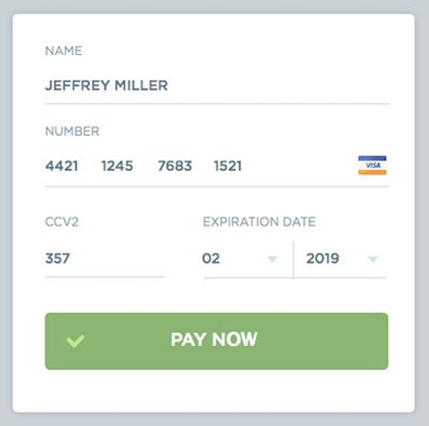

# Payrails Product assessement

Welcome to the Payrails Product assessement! This repository contains all the resources you need to complete the Payrails Product assessment. 

> [!IMPORTANT]
> Read this page very carefully to understand the precise expectations before you get started.

## Goal

**Create an Application for tokenizing cards via Payrails using Client Side Encryption**!

## Setup & Resources

These are the recources and tooling you will need to successfully deliver your assessment.

### Payrails documentation

Payrails documentation is available [here](https://docs.payrails.com/). It contains: 
- [Guides / tutorials](https://docs.payrails.com/docs)
- [API reference](https://docs.payrails.com/reference/)

> [!NOTE]
> Beware Payrails is a complex product supporting many features and flows. You should probably follow the assessment steps and cherry-pick what you need from the documentation, rather than going head first into understanding all Payrails concepts from the documentation.


### Mockoon

[Mockcoon](https://mockoon.com/) is a simple API mock server you can run locally to simulate Payrails API for this exercise. 

You can either use the [Mockoon CLI](https://github.com/mockoon/mockoon/tree/main/packages/cli#installation):

```
# Install Mockoon CLI
npm install -g @mockoon/cli

# run Mockoon CLI with Payrails mock API on http://localhost:3001
mockoon-cli start --data ./mockoon.json
```

Or install [Mockoon Desktop](https://mockoon.com/download/), import [mockoon.json](./mockoon.json) and `run` the environment.

### Postman

To test the mock API in a GUI, you can import the [Postman Collection](postman.json) of the exercise directly into your personal workspace.

It is pre-configured to target your local Mockoon mock server on port `3001`.  

## Sequence of steps

Here's the sequence of steps the card tokenization will follow:

```mermaid
sequenceDiagram
    autonumber

    participant client as Your Frontend
    participant backend as Your Backend
    participant payrails as Payrails API

    Note over client,payrails: 1. Initialize your client
    client->>+backend: Load the page
    backend->>+payrails: [POST] Request an access token
    payrails-->>-backend: return token
    backend->>+payrails: [POST] Initialize the client
    payrails-->>-backend: return client credentials
    backend-->>-client: return client credentials

    Note over client,payrails: 2. Tokenize the card
    client-->>client: encrypt the card
    client->>+payrails: [POST] Tokenize an Instrument
    payrails-->>-client: return Payment Instrument
```

### 1. Initialize your client

#### 1.1 Request access token

First, your must authenticate yourself to Payrails in order to fetch the Client Side Encryption credentials. Use the [Request access token](https://docs.payrails.com/reference/getoauthtoken) endpoint for that matter.

> [!IMPORTANT]
> The authentication request to Payrails contains your secret Payrails API key in the `x-api-key` header. It is obviously very sensitive information. Therefore the request must be performed from your server-side application so that the secret isn't shared with the client.

In this exercise, the mock server will accept any value for the API key, so you can decide the value. Just make sure the `x-api-key` is present.

Save the `access_token` value in the Response, you will now use it to authenticate the next API call to fetch the client credentials. 

#### 1.2 Initialize the client

This request must also happen on your server-side, straight after [1.1 Request access token](#11-request-access-token).

Your are going to call the [Initialize a client SDK](https://docs.payrails.com/reference/clientinit) with:
- the bearer token you saved from the [1.1 Request access token](#11-request-access-token) as an `authorization` Header
- the request body parameter `type` set for Client Side Encryption:
```json
{
  "type": "tokenization",
  "holderReference": "some customer reference"
}
```

Payrails API will return all configurations to initialize your client in the `data` field as a `base64` string. Take the value and decode it (most programming language provide native helpers, e.g., [javascript](https://developer.mozilla.org/en-US/docs/Glossary/Base64#javascript_support)).

After decoding the data, you obtain a JSON object. Pass the following to your frontend, you will need both for tokenization:
- `holderReference`
- `tokenization.publicKey`

### 2. Tokenize the card

To tokenize a card you need a frontend with a card form similar to: 


> [!NOTE]
> Please note styling doesn't matter and will not be takend into the assessment evaluation.

#### 2.1 Encrypt the card

With your Form, collect and arrange all the relevant payment details into a json object with the following fields: 
```json
{
    "cardNumber": "4111111111111111",
    "expiryMonth": "03",
    "expiryYear": "30",
    "securityCode": "737",
    "holderName": "John Doe",
    "holderReference": "customer123"
}
```

Now, encrypt the full json of the payment details with the public key given by Payrails.

- The public key is a PKCS8 RSA public key in `PEM`` format without header and line breaks. The key will be given to you by Payrails.
- The encrypted data should be encrypted using JWE with encryption algorithm `RSA-OAEP-256` and content encryption `A256CBC-HS512`.

You can find some examples how to encrypt payment details with the public key given by Payrails [here](https://docs.payrails.com/docs/tokenize-cards-with-backend-side-encryption). Unfortunately, none of them is in `Javascript` or `Typescript` for you Client.

#### 2.1 Create a Payment Instrument

Call the tokenization endpoint with the encrypted payment details.
```json
{
    "holderReference": "some customer reference",
    "encryptedInstrumentDetails": "your encrypted card data",
    "futureUsage": "CardOnFile",
    "storeInstrument": true
}
```
To ensure successful tokenization, please verify that the holder reference provided in the encrypted instrument details matches the holder reference sent in the body request. If the references do not match, the tokenization process will be rejected.

## Expectations

1. Use the programming language(s) of your choice: we love them all, it really doesn't matter!
2. Clone this repository and push the your solution there.
3. Extend this Readme with some instructions to test your solution.
4. Prepare yourself for an online demo and code review.

## Last advice before you get started

- **We evaluate if you can follow instructions and get stuff done!** So focus on the above instructions and do not waste too much time on the GUI or the code quality.
- **Are you stuck?** It's fine to research on Stakeoverflow and ChatGPT. But beware to understand what you're pasting because we will code review together and ask questions!
- **Don't give up!** The mock server is permissive, it will never complain! Therefore if you get stuck at a step, don't give up! Keep going with the rest of the assessment and we will debrief during the review what was your blocker. 

## Support

If your have questions or if you are facing issues with the tooling, please reach out to Payrails Hiring Manager in charge of your application via email.
